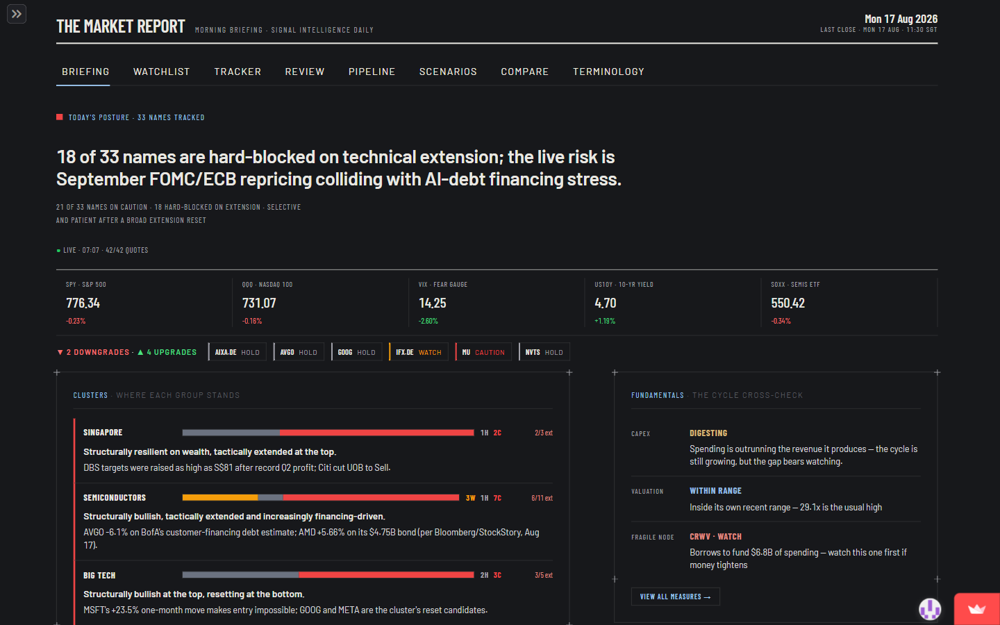

# MarketReport Dashboard

**Live app: <https://market-dashboard-pmaqheorcgz33tmzqr4f56.streamlit.app/>**

If the app has gone to sleep, click "Yes, get this app back up!" and give it a minute.

A daily market intelligence dashboard, updated every morning by an automated
pipeline that has run unattended since March 2026. The pipeline (a separate,
private repo) pulls prices and news for 33 tickers, computes the technical
indicators and risk-reward levels in Python, has an AI model (DeepSeek API)
write the commentary, validates and repairs the model's JSON output, then
pushes the day's data files here. Every number shown is computed in code; the
AI writes words, never figures.

This repo is the public half: the Streamlit front end, the data it renders,
and the tests behind it.

## What's inside

- `dashboard.py`: Streamlit entry point, with Briefing, Watchlist, Tracker,
  Review, Pipeline, Scenarios, Compare and Terminology tabs
- `components/` and `lib/`: Plotly charts and rendering helpers
- `live_prices.py`: optional live quotes from Yahoo during market hours
- `data/`: the CSV and JSON files the pipeline publishes each morning
- `tests/`: 31 test files run through GitHub Actions on every change,
  including a visual regression harness that screenshots each page and diffs
  it against committed baselines

## Notes

- Signals shown are research output, not financial advice.
- The analysis pipeline itself stays private; this repo contains no API keys
  and no pipeline code.
