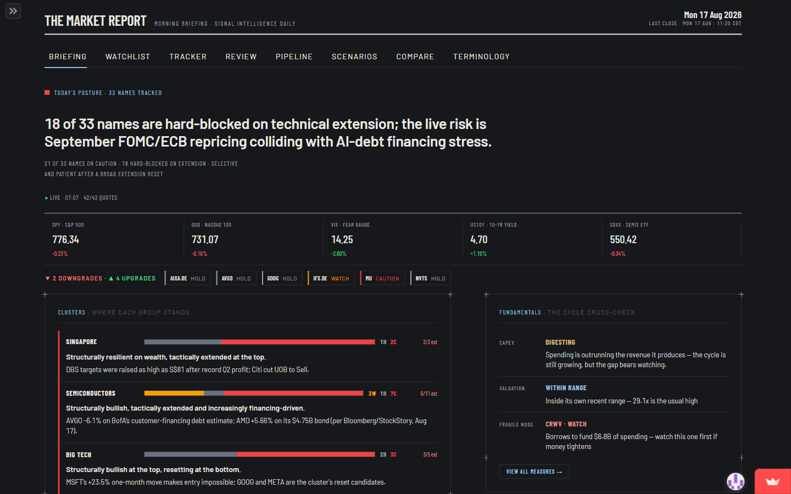

# MarketReport Dashboard

**Live app: <https://market-dashboard-pmaqheorcgz33tmzqr4f56.streamlit.app/>**

If the app has gone to sleep, click "Yes, get this app back up!" and give it a minute.

A daily market data dashboard, updated every weekday by an automated
pipeline that has run unattended since March 2026. The pipeline (a separate,
private repo) pulls prices, fundamentals, earnings dates and news for 33
tickers, computes the technical indicators and price levels in Python, and
pushes the day's data files here. The site shows facts only — prices,
technicals, levels, valuation, earnings and sourced headlines, in one fixed
order — with no buy / sell ratings (since 2026-10-01). Each name opens to its
price since its first report (March to August 2026, depending on when the name
joined; with its 50- and 200-day averages), its price levels,
technicals, valuation, earnings history and recent headlines. The daily briefing card
is written separately and carries its sources.

This repo is the public half: the Streamlit front end, the data it renders,
and the tests behind it.

## What's inside

- `dashboard.py`: Streamlit entry point, with Briefing, Watchlist and
  Terminology tabs
- `components/` and `lib/`: page sections, inline-SVG charts and rendering helpers
- `live_prices.py`: optional live quotes from Yahoo during market hours
- `data/`: the CSV and JSON files the pipeline publishes each morning
- `tests/`: 24 test files run through GitHub Actions on every change, plus
  an on-demand visual regression harness (`tests/visual/`) that screenshots
  each page and diffs it against committed baselines

## Notes

- Information only, not financial advice: the site rates and ranks nothing.
- The analysis pipeline itself stays private; this repo contains no API keys
  and no pipeline code.
